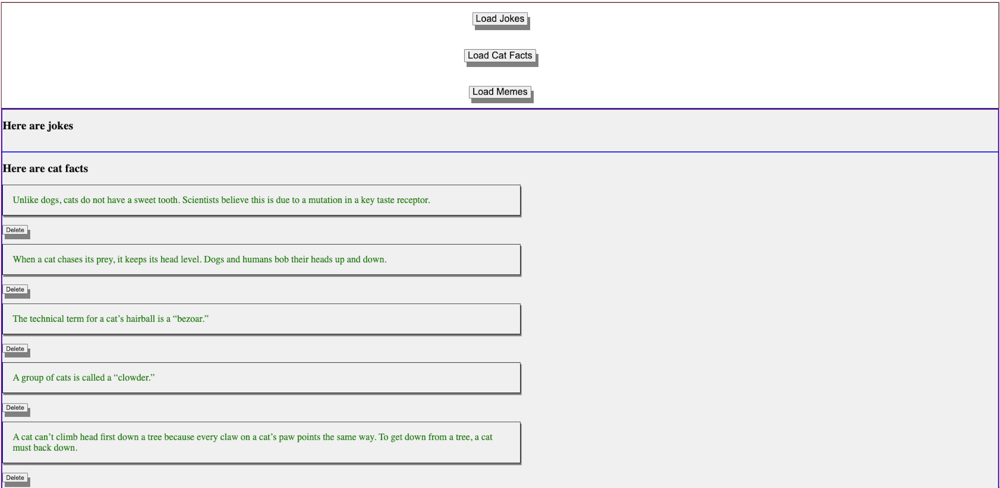
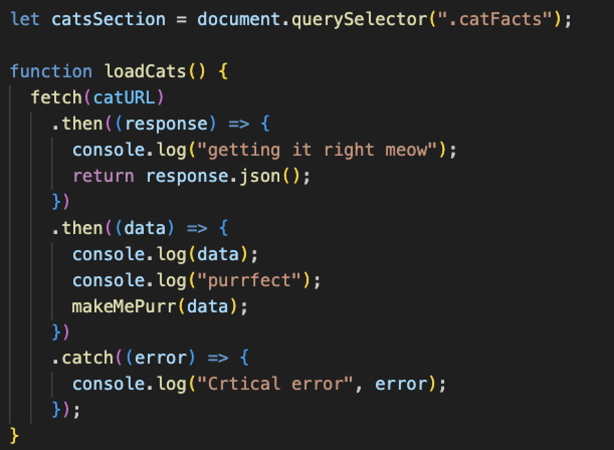

# Fetch API to Load Stuff

---

# Intro

This project was created in my 3rd week of coding bootcamp at General Assembly using JavavScript, HTML, and CSS. It uses the fundamentals of fetch API to allow jokes, cat facts, and memes to be loaded.

---

# Design

The following 3 APIs were used.

- Jokes API: https://official-joke-api.appspot.com/random_ten
- Cat Facts API: https://catfact.ninja/facts?limit=10
- Memes API: https://api.imgflip.com/get_memes

Each button on the main page once clicked will load the content from its respective API above. 

If the API response includes more than 100 items, array methods are used to limit the display to a maximum of 100 items. Additionally, once displayed, each of the cat facts and jokes all have a Delete button that deletes the respective instance of fact or joke.



---

# Functionality

For each of the 3 APIs:

`fetch` initiates the request to the API's url. The system waits for the data to come back (`.then((response`) and the data is parsed as JSON (` return response.json();`). Then the parsed data is handled (`.then((data)`) and a custom function is run to process that data- for example `makeMePurr(data)`. Lastly, a catch is added so that should there be any error during fetching or parsing, an error is logged to the console.

This `fetch` functionality along with its chained methods are enclosed in a "main" function. For "cat facts", its "main" function is called `loadCats`. `loadCats` is only run when the "Load Cat Facts" button is clicked. This happens due to eveent listeners. 

The chained custom function contained within our `fetch` - in this case `makeMePurr` runs after our API data is parsed. `makeMePurr` uses DOM maniuplation to add the cat fact, and styling is added as well through the `classList.add`.  Additionally, a delete button is generated next to each fact. Once that delete button is clicked, then the delete button along with its respective fact is removed. 

When the user clicks the "Delete" button, immediately remove the item from the display. 

The aforementioned logic applies to the `loadJokes`. As for `loadMemes`, when images are added via DOM maniuplation, the URL of the image that is added references the URL listed in each of meme instances in the array provided in the meme API.

---

# What I Learned

## Asynchronous
In short, asynchronoous means code that runs in the background while subsequent code runs.

In our case- as soon as `fetch` is called, it initiates an asynchronous operation to fetch data from its respective API URL. The operation returns a "promise"- meaning that this will eventually be fulfilled with the result of response from the API server or rejected with an error if something goes wrong. Because of this "promise", Java doesn't wait for the `fetch` operation to complete before moving on to the next line of code. This way, while `fetch` code is running, subsequent code below can run. Finally, once the asynchronous `fetch` is completed, it's chained methods like processing that data via my custom functions can then run.



## slicedData
To ensure that only 100 items were displayed at a time, we used the `.slice` method. 
For example, the code block below shows how we take the array of memes from our meme API url.
The first `data` represents our parsed data from that API. Inside that data, we have a data object (represented by that second `.data`.), and inside of that we have an array named memes. 

This is why we run our `.slice` method on `data.data.memes` array. The numbers 0 and 100 (in parenthesis after) specify the range of elements to extra from the array, with 0 referring to the first element. The slicing operations thus includes elements (or memes in this case) from index 0 up to, but not including, index 100. 

```
function makeMemes(data) {
let slicedData = data.data.memes.slice(0, 100);
  slicedData.forEach((memeItem) => {code here
  })
}
```

